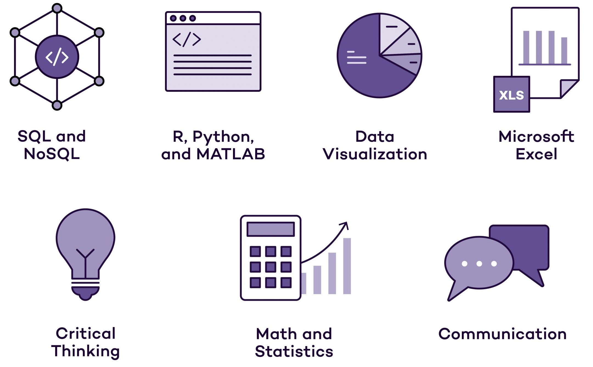

[<h1 align="center">Welcome to my profile 👋</h1>

### 🤔 Code with a smile 🤔

- 🔭 I have some amazing projects on my repository. Take a glance with a smile.
- 🌱 Since there is never enough, I keep learning to continue building solutions.
- 👯 I’m open to collaborations. Bring it on!
- 🤔 I currently work on data analytics/science related projects. 
- 💬 Free free to ask me any question but basically coding related.
- 📫 Reach me on Linkedln at [Linkedln](https://www.linkedin.com/in/dekoma4u/) or [Twitter](https://www.twitter.com/dekoma4u)
- 😄 He/him
- ⚡ Fun fact: football, table tennis, music \

## Click [GitHub Repository](https://github.com/dekoma4u?tab=repositories) to view my public repositories. I recently brought to the public an old and local project on Business intelligence and analytics with PowerBI. Feel free to give me some feedbacks. It will mean a lot to me. 
>**I'm glad you visited. I hope you are kind with me for a journey of a thousand miles starts with a step👋** 

](https://github.com/dekoma4u/Data_Visualisation_with_PowerBI_record_projects/blob/master/Lab8%20-%20All%20Exercise%20Solution/Images/Sales%20Report.PNG).
